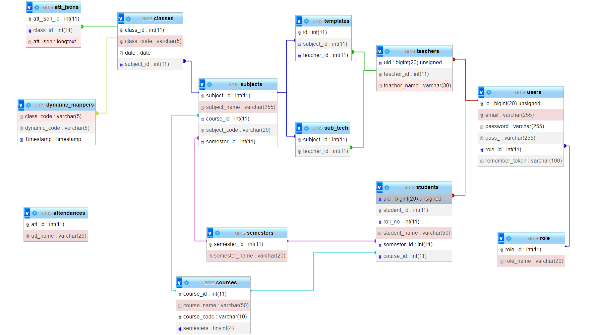
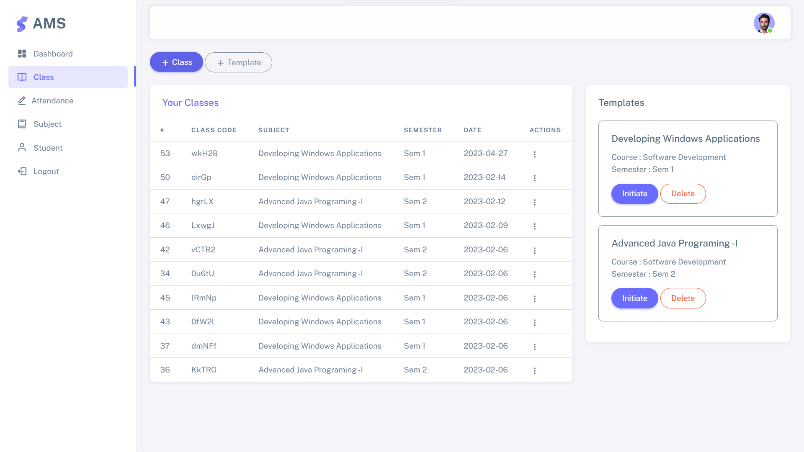
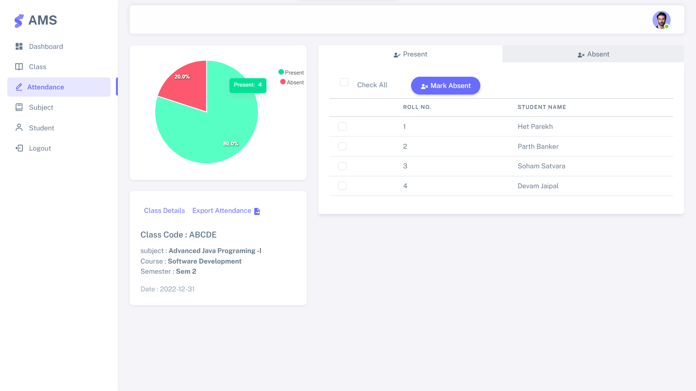
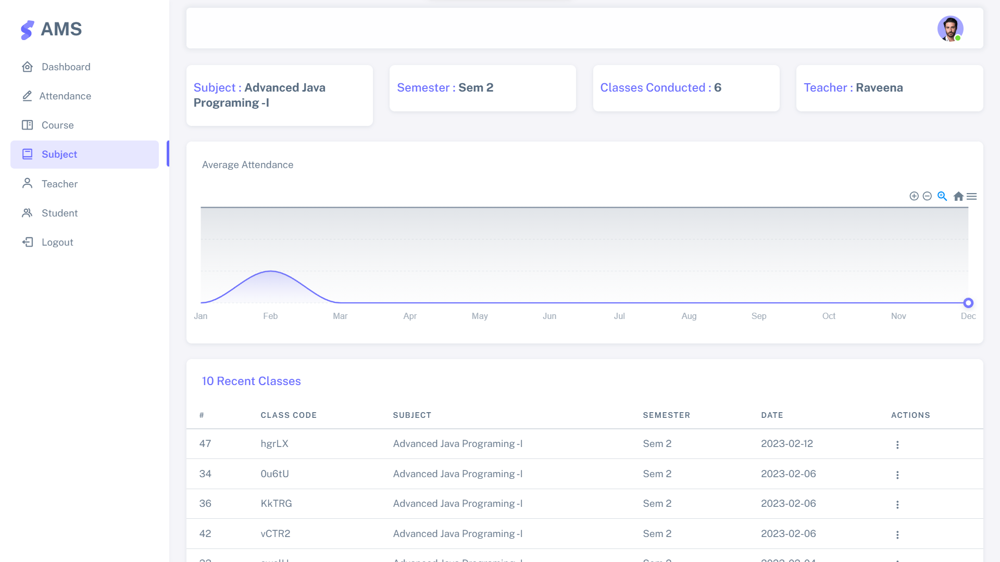

AMS

## About AMS

The QR attendance management system project aims to develop an automated and efficient solution to revolutionize attendance tracking in educational institutions. The traditional manual processes are prone to errors, time-consuming, and lack real-time analysis capabilities. By leveraging Quick Response (QR) codes and advanced technology, the project intends to simplify attendance management, enhance accuracy, and provide administrators with valuable insights for decision-making.

The project focuses on resolving the following key challenges:
- Manual Data Entry: The system eliminates the need for manual data entry by utilizing QR codes. Students, faculty, and staff members can scan their unique QR codes to mark their attendance instantly, reducing the risk of human errors and saving administrative time.

- Real-Time Analysis: The system provides administrators with comprehensive dashboards and reports for real-time data analysis. This enables them to monitor attendance trends, identify patterns, and generate insightful analytics to inform decision-making and intervention strategies

- Accessibility and User Experience: The system offers cross-platform accessibility and ensures a user-friendly experience across different devices and operating systems. This allows users to access the system seamlessly, enhancing usability and convenience.

## ER Diagram and Scrennshots 

## Tech-Stack

The tech stack comprises of latest technologies in the market at the current time : 

- Laravel
- AJAX 
- jQuery 
- HTML, Bootstrap, JS 
